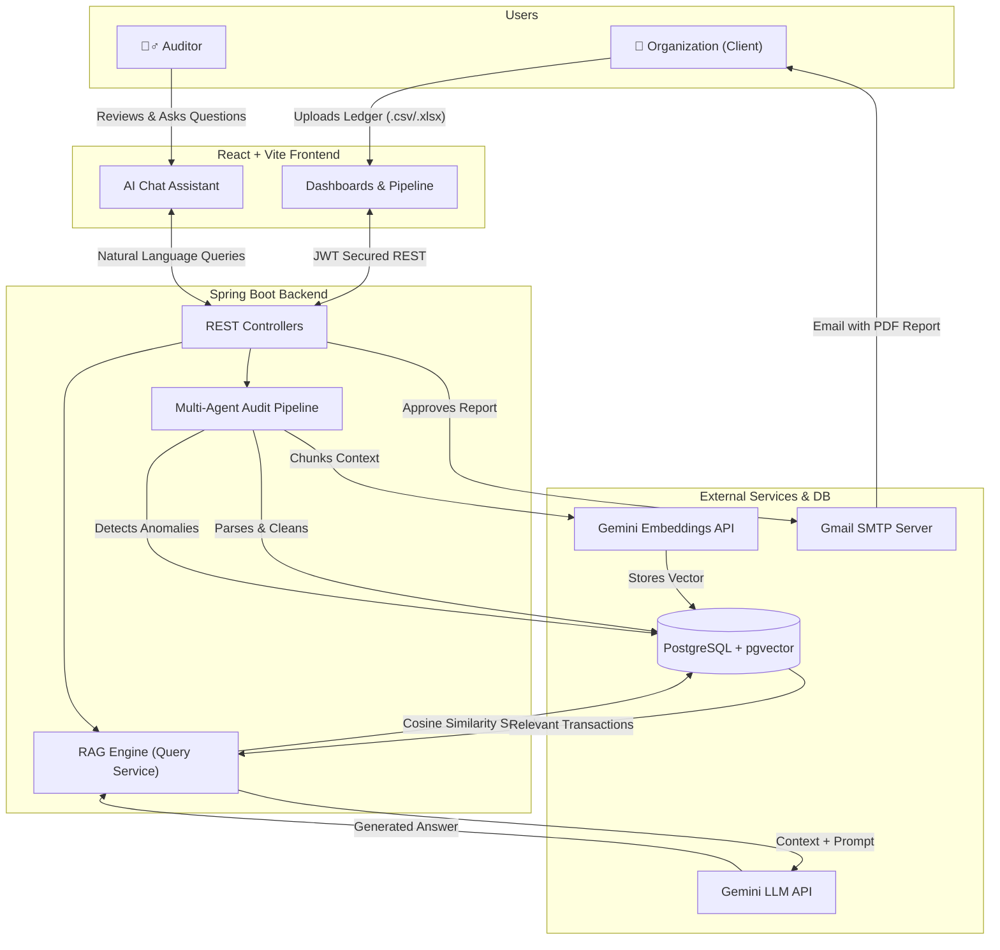

# 🕵️‍♂️ AuditIQ - AI-Powered Audit Automation

AuditIQ is an enterprise-grade, multi-agent platform designed to automate financial ledger auditing. It securely ingests organizational data, runs it through a sophisticated anomaly detection pipeline, generates vector embeddings for semantic search, and empowers auditors with a Natural Language AI Assistant capable of answering deep analytical questions about the financial data.

---

## 🏗️ Architecture & Data Flow



---

## ✨ Key Features

1. **Role-Based Portals:** Separate, secure experiences for Organizations (Data Upload) and Auditors (Review & Analysis).
2. **Multi-Agent Pipeline:** Automatically ingests, cleans, detects anomalies, and generates vector embeddings as a background process.
3. **Retrieval-Augmented Generation (RAG):** Auditors can "chat" with the uploaded datasets. The backend performs semantic similarity searches via `pgvector` and feeds exact transactional context to Google Gemini to answer complex questions (e.g., *"Are there duplicate high-value payments?"*).
4. **Automated Reporting:** Generates beautiful frontend reports that can be printed as PDFs and automatically emailed to clients via SMTP integration.
5. **Modern, Polished UI:** Built with React, Tailwind CSS, and Framer Motion for a premium, responsive, and highly interactive user experience.

---

## 🛠️ Technology Stack

**Frontend:**
- React 18 (Vite)
- Tailwind CSS + Framer Motion (Styling & Animations)
- Zustand (State Management)
- Lucide React (Icons)
- Axios (API Client)

**Backend:**
- Java 21 + Spring Boot 3
- Spring Security (JWT Stateless Authentication)
- Hibernate / JPA
- Google Gemini API (LLM & Embeddings integration)
- JavaMailSender (Automated Emailing)

**Database & Infrastructure:**
- PostgreSQL 16
- `pgvector` Extension (Semantic Vector Search)
- Docker & Docker Compose (Container Orchestration)

---

## 🚀 Getting Started (Docker - Recommended)

The absolute easiest way to run AuditIQ is using the included Docker Compose setup. This will instantly spin up the Postgres Database with `pgvector`, the Spring Boot backend, and the React frontend.

### 1. Prerequisites
- Docker & Docker Desktop installed.
- A free [Google Gemini API Key](https://aistudio.google.com/app/apikey).

### 2. Configuration
Create a `.env` file in the root of the project (you can rename `env.example` to `.env`):
```env
GEMINI_API_KEY=your_actual_gemini_api_key_here
```

Inside `auditIq-backend/src/main/resources/application.properties.example`, you can find the complete application config. By default, the Docker setup handles the database credentials for you. Ensure your Gmail SMTP configuration is set if you want the email feature to work.

### 3. Build & Run
From the root of the project, run:
```bash
docker compose up --build -d
```

### 4. Access the Application
- **Frontend App:** [http://localhost:3000](http://localhost:3000)
- **Backend API:** [http://localhost:8082](http://localhost:8082)

*(The default database is exposed on port `5433` locally to prevent conflicts with local installations).*

---

## 💻 Local Development Setup

If you prefer to run the applications locally without Docker (e.g., for active development):

### 1. Start PostgreSQL with pgvector
```bash
docker run --name auditiq-postgres -e POSTGRES_USER=postgres -e POSTGRES_PASSWORD=postgres -e POSTGRES_DB=auditiq_db -p 5432:5432 -d pgvector/pgvector:pg16
```
*(Make sure to log in and run `CREATE EXTENSION IF NOT EXISTS vector;` if running natively outside Docker).*

### 2. Start Backend
```bash
cd auditIq-backend
# Update application.properties with your DB credentials & Gemini Key
./gradlew bootRun
```

### 3. Start Frontend
```bash
cd auditIq-frontend
bun install  # or npm install
bun run dev  # or npm run dev
```
The local dev server will run on [http://localhost:5173](http://localhost:5173).

---

## 🔒 Security Note
**Never commit your `.env` or `application.properties` files containing real API keys or passwords to a public repository.** They have been securely ignored in the `.gitignore` setup of this project.

---

*Generated by AuditIQ · Built for Deloitte Hacksplosion 2026*
